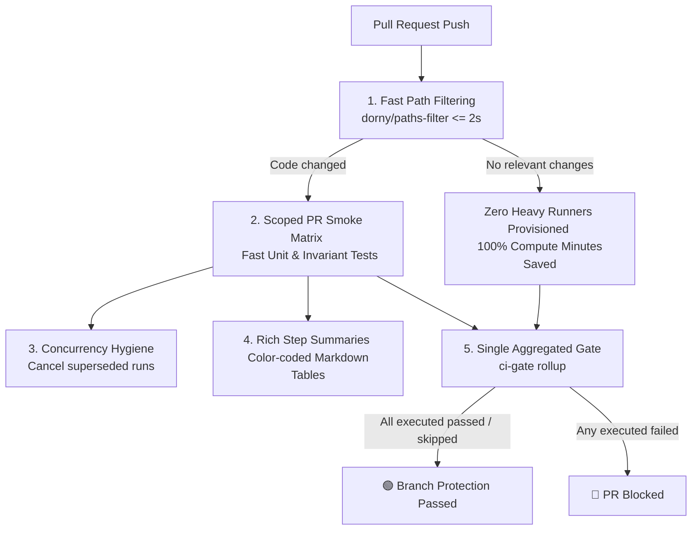
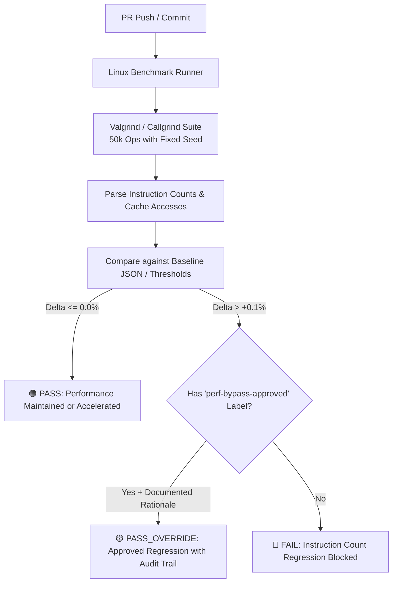
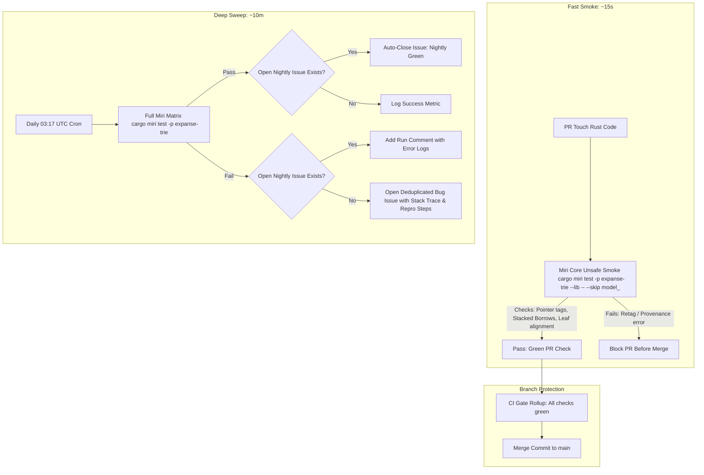

# CI/CD & Zero-Regression Engineering Guide

Welcome to the **Expanse & Sister Projects CI/CD Guide**. This document establishes mandatory engineering standards, workflow architectures, regression gating rules, and operational best practices for all autonomous AI coding agents and human engineers designing or maintaining GitHub Actions pipelines across **`expanse`**, **`php-judy`**, **`judy-cache`**, **`judy-polyfill`**, **`yaml-workflows`**, **`gws-connectors`**, and future projects.

---

## 1. The 5 Commandments of High-Efficiency CI/CD



### 1. Zero-Compute on Irrelevant PRs (Two-Tiered Path Filtering)
- Never spin up dozens of heavy compilation runners on PRs touching only documentation (`docs/**`), markdown files (`*.md`), or unrelated scripts.
- Use a single, lightweight ($\le 2\text{s}$) initial job (`detect-changes`) powered by `dorny/paths-filter`.
- Downstream verification jobs declare `needs: [detect-changes]` and `if: needs.detect-changes.outputs.<subsystem> == 'true'`.

### 2. Organization-Wide Concurrency Hygiene (Cancel Superseded Runs)
- GitHub Actions runner minutes and queue concurrency are pooled **across the entire organization**.
- When new commits are pushed to an open pull request, immediately cancel in-flight runs from previous commits:
  ```yaml
  concurrency:
    group: ${{ github.workflow }}-${{ github.head_ref || github.run_id }}
    cancel-in-progress: ${{ github.event_name == 'pull_request' }}
  ```
- Merges to `main` (`push`) must use unique run IDs (`github.run_id`) with `cancel-in-progress: false` to ensure every merge has a complete, persistent audit trail.

### 3. Single Rollup Gate for Branch Protection (`ci-gate`)
- **The Problem**: Requiring individual matrix jobs in branch protection causes PRs to deadlock in "Pending" when path filters skip non-applicable jobs.
- **The Solution**: Branch protection requires **only one check**: `CI Gate / All Checks Passed` (`ci-gate`).
- The `ci-gate` job runs `if: always()`, inspects `${{ toJson(needs) }}`, and treats cleanly skipped jobs as successful.

### 4. PR Smoke vs. Release Matrix Separation
- **Pull Request Stage**: Fast, low-latency smoke testing (compilation, linter, core unit tests, fast unsafe invariants).
- **Release Stage (`tags: v*`)**: Full multi-architecture binary compilation (e.g. 5-platform Python wheels, cross-compiled Debian/RPM packages, Windows MSVC DLLs).

### 5. Rich Color-Coded Step Summaries
- Output structured, human-readable Markdown tables to `$GITHUB_STEP_SUMMARY` with explicit status indicators (🟢 PASS, 🟡 PARITY, 🔴 REGRESSION).

---

## 2. Upstream Network Resilience & Thundering-Herd Mitigation

When running large matrices across dozens of runner VMs, simultaneous network requests can trigger upstream rate limits or `504 Gateway Timeout` errors (e.g., the `php-judy` v2.7.1 incident hitting `downloads.php.net`).

### Resilient Network Standards

#### 1. Standard Resilient Curl Wrapper
Never use bare `curl -f`. Always configure exponential backoff, connection retries, and max execution time:
```bash
curl --retry 5 \
     --retry-delay 2 \
     --retry-max-time 60 \
     --retry-all-errors \
     --retry-connrefused \
     -fsSL "$URL" -o "$OUTPUT"
```

#### 2. Startup Sleep Jitter for Matrix Jobs
When 20+ matrix jobs start concurrently, stagger their initial network requests:
```bash
# Stagger simultaneous runner network requests by 1..5 seconds
sleep $(( (RANDOM % 5) + 1 ))
```

#### 3. Matrix Concurrency Throttling (`max-parallel`)
For heavy release matrices interacting with external CDNs or package registries, limit concurrent jobs:
```yaml
strategy:
  fail-fast: false
  max-parallel: 6
  matrix:
    ...
```

#### 4. Automated Step-Level Retries (`nick-fields/retry`)
Wrap flaky setup steps (e.g. `setup-php`, `maturin-action`, `apt-get`) with automated retry logic:
```yaml
- name: Resilient Package Installation
  uses: nick-fields/retry@v3
  with:
    timeout_minutes: 5
    max_attempts: 3
    retry_wait_seconds: 5
    command: pip install --upgrade pip && pip install "maturin>=1.5,<2.0" pytest
```

---

## 3. Performance & Software Regression Prevention

### 3.1 Why Wall-Clock Benchmarks Fail in CI
Wall-clock timing (`std::time::Instant`, criterion nanoseconds) on shared cloud CI runners exhibits $\pm 20\text{--}50\%$ noise due to VM multi-tenancy, hyperthread throttling, and background host load. Gating builds on raw wall-clock time causes frequent false-positive CI failures.

### 3.2 Deterministic Instruction Counting (Valgrind / Callgrind / Iai)
Expanse uses **hardware-agnostic, deterministic instruction counting**:
1. Counts total CPU instructions retired (`Ir`).
2. Counts L1 Data Cache accesses (`Dr`/`Dw`) and Last Level Cache (LLC) misses.
3. **The Invariant**: For a fixed 50k operation workload with fixed seed, `Ir` is **100% deterministic down to the exact integer**.
4. **The Gate Rule**: Any PR increasing instruction count by $>0.1\%$ vs baseline main without an approved bypass fails the build automatically.



### 3.3 Interleaved Dual-Arm Comparative Ratio Benchmark Pattern (`php-judy`)
When micro-benchmarking full end-to-end execution where instruction counting is unavailable (e.g. PHP runtime, JIT):
- Never compare absolute wall-clock durations across runs.
- Measure two arms (**Arm S** = pristine baseline, **Arm C** = candidate PR) in **alternating interleaved rounds on the exact same runner**.
- Gate strictly on the ratio:
  $$\text{Ratio} = \frac{\text{Candidate Time}}{\text{Baseline Time}}$$
- Runner slowdown slows both arms equally, keeping the ratio noise-free.

### 3.4 Controlled Performance Bypass Protocol
When an architectural change deliberately trades a minor instruction increase for a critical feature (e.g. security hardening, transaction snapshot isolation, metadata tagging):
1. **PR Label**: PR must have the GitHub label `perf-bypass-approved` added by a repository maintainer.
2. **PR Description Rationale**: PR body must contain an explicit section:
   ```markdown
   ### Performance Trade-off Disclosure
   - **Regressed Metric**: `map_insert / random` (+1.8% instructions)
   - **Load-Bearing Rationale**: Added 32-bit hot metadata value slots for columnar predicate pushdown.
   - **Net System Win**: Scanning range queries is 6.8x faster with 0 cold DRAM fetches.
   ```
3. **Audit Trail**: The CI step summary logs `PASS_OVERRIDE (Approved by Maintainer)`.

### 3.5 Memory Density & Zero-Heap-Churn Assertions
- **Memory Density Budget**: Measure total heap bytes divided by key count; assert strict ceilings (e.g. $\le 0.50\text{ B/key}$ for sets, $\le 9.00\text{ B/key}$ for maps).
- **Zero-Allocation Invariant (`no_heap_churn.rs`)**: Custom tracking allocator asserts `allocated_bytes == 0` during read-only lookups, contains queries, and range navigations.

---

## 4. 3-Tiered Miri & Undefined Behavior Prevention



### Tier 1: Pull Request Fast Miri Smoke (`ci.yml`)
- **Command**: `cargo miri test -p expanse-trie --lib -- --skip model_`
- **Execution Time**: $\le 15\text{ seconds}$ on Linux x86_64.
- **Coverage**: Validates 100% of raw pointer derivations in `get.rs`, `mutate.rs`, `mutate_map.rs`, `slot.rs`, `leaf.rs`, and `node.rs`. Catches Stacked Borrows / Tree Borrows invalidations *before* merging.

### Tier 2: CI Gate Rollup (`ci.yml`)
- `ci-gate` requires Tier 1 Miri to pass before any PR is mergeable.

### Tier 3: Nightly Full Matrix & Automated Incident Triage (`nightly.yml`)
- Executes full test suite under Miri including long-running randomized model sweeps (`proptest_model.rs`).
- Automatically creates or updates deduplicated GitHub issues on failure, and auto-closes them on recovery.

---

## 5. Automated Nightly Failure Triage Pattern

Nightly workflows run out-of-band without a human reviewing PR check results. To prevent silent test failures from rotting unnoticed:

```yaml
- name: Report or Update Nightly Failure Issue
  if: failure() && github.event_name == 'schedule'
  uses: actions/github-script@v7
  with:
    script: |
      const title = '🚨 [Nightly CI Failure] Full Miri / Model Verification Failed on main';
      const { data: issues } = await github.rest.issues.listForRepo({
        owner: context.repo.owner,
        repo: context.repo.repo,
        state: 'open',
        labels: 'nightly-failure'
      });
      
      const existing = issues.find(i => i.title.includes('Full Miri'));
      const body = `### Nightly Verification Failure Alert
      
      - **Commit**: [${context.sha}](${context.payload.repository?.html_url}/commit/${context.sha})
      - **Workflow Run**: [View Failed Run Logs](${context.serverUrl}/${context.repo.owner}/${context.repo.repo}/actions/runs/${context.runId})
      - **Failing Target**: \`cargo miri test -p expanse-trie\`
      
      #### Local Reproduction Command:
      \`\`\`bash
      cargo miri test -p expanse-trie
      \`\`\`
      `;
      
      if (existing) {
        await github.rest.issues.createComment({
          owner: context.repo.owner,
          repo: context.repo.repo,
          issue_number: existing.number,
          body: `⚠️ Nightly run still failing on commit ${context.sha}. [View Run](${context.serverUrl}/${context.repo.owner}/${context.repo.repo}/actions/runs/${context.runId})`
        });
      } else {
        await github.rest.issues.create({
          owner: context.repo.owner,
          repo: context.repo.repo,
          title: title,
          body: body,
          labels: ['bug', 'nightly-failure', 'automated-triage']
        });
      }

- name: Auto-Close Resolved Nightly Issue on Success
  if: success() && github.event_name == 'schedule'
  uses: actions/github-script@v7
  with:
    script: |
      const { data: issues } = await github.rest.issues.listForRepo({
        owner: context.repo.owner,
        repo: context.repo.repo,
        state: 'open',
        labels: 'nightly-failure'
      });
      const existing = issues.find(i => i.title.includes('Full Miri'));
      if (existing) {
        await github.rest.issues.createComment({
          owner: context.repo.owner,
          repo: context.repo.repo,
          issue_number: existing.number,
          body: `🟢 Nightly verification succeeded on commit ${context.sha}! Auto-closing this issue.`
        });
        await github.rest.issues.update({
          owner: context.repo.owner,
          repo: context.repo.repo,
          issue_number: existing.number,
          state: 'closed'
        });
      }
```

---

## 6. Architectural Role of `yaml-workflows` GitHub Action

When deciding between native GitHub Actions YAML and `orieg/yaml-workflow`:

| Workflow Stage | Recommended Architecture | Rationale |
| :--- | :--- | :--- |
| **Core PR CI (`ci.yml`)** | **Native GitHub Actions** | Zero Python/pip setup overhead; sub-second runner startup; direct compiler diagnostic streaming. |
| **Multi-Arch Release Packaging (`release.yml`)** | **`yaml-workflows` Action** | Ideal for DAG-based multi-artifact bundling, checksum calculations, templating changelogs, and cloud publishing. |
| **Nightly Cross-Repo Sweeps (`nightly.yml`)** | **`yaml-workflows` Action** | Excellent for running comparative sweeps across `expanse`, `php-judy`, `judy-cache`, and synthesizing unified JSON/SVG reports. |
| **Static Documentation Portals (`pages.yml`)** | **`yaml-workflows` Action** | Multi-step site compilation, broken link verification, and asset staging. |

---

## 7. Multi-Project Architecture & Quick-Start Checklist

Use this checklist when creating a new project or updating an existing sister repository:

### Standard Matrix Template

| Repository | Primary Technology | Key Quality Gates | Path Filter Configuration |
| :--- | :--- | :--- | :--- |
| **`expanse`** | Rust 2024 / C ABI | 1. Callgrind instruction gate<br/>2. Tier 1 Fast Miri smoke ($\le 50\text{s}$)<br/>3. Loom atomic race model tests<br/>4. 32-Bit Bare-Metal Cross-Compiles (`RV32IMAC` & `Cortex-M4`)<br/>5. Memory density assertions ($\le 0.40\text{ B/key}$)<br/>6. Differential stock-oracle verification | `crates/**`, `Cargo.toml`, `Cargo.lock`, `rust-toolchain*`, `.github/workflows/ci.yml` |
| **`php-judy`** | C / PHP Extension | 1. Interleaved dual-arm benchmark gate (`bench-gate.php`)<br/>2. Valgrind zero-leak check (`--leak-check=full --error-exitcode=1 php run-tests.php -P`)<br/>3. PHP 8.1..8.5 matrix + ZTS<br/>4. Compiler warning zero-tolerance (`set -o pipefail` + first-party filter)<br/>5. Memory ceiling ($\le 25\text{ B/key}$) | `php_judy.*`, `judy_*.*`, `config.m4`, `tests/**`, `.github/workflows/**`, `libjudy/**`, `tools/**` |
| **`judy-cache`** | C / PHP Extension | 1. Runtime dependency version floor check (`judy_version() >= 2.6.0`)<br/>2. APCu & Redis YCSB comparison gate<br/>3. Multithreaded churn thrash gate (0 deadlocks)<br/>4. GC compaction pause ceiling ($\le 1.0\text{ ms}$) | `src/**`, `include/**`, `tests/**` |
| **`judy-polyfill`** | Pure PHP | 1. PHPUnit across PHP 8.1..8.5<br/>2. PHPStan Level 9 + Psalm<br/>3. Infection Mutation Testing (MSI $\ge 90\%$) | `src/**`, `tests/**`, `composer.json` |
| **`yaml-workflows`** | Python / GitHub Actions | 1. `actionlint` schema validation<br/>2. ShellCheck on inline action scripts<br/>3. Smart matrix pruning (full versions on Linux, LTS only on Windows/macOS) | `*.yml`, `actions/**`, `scripts/**` |
| **`gws-connectors`** | TypeScript / Go | 1. `golangci-lint` / `biome`<br/>2. Unit test suite with mock API<br/>3. Concurrency cancellation hygiene | `src/**`, `go.mod`, `package.json` |

### New Project Setup Checklist:
- [ ] 1. Define `concurrency` with `cancel-in-progress: ${{ github.event_name == 'pull_request' }}`.
- [ ] 2. Create `detect-changes` job with `dorny/paths-filter@v3`.
- [ ] 3. Gate downstream test jobs on `needs: [detect-changes]` and `if: needs.detect-changes.outputs.<subsystem> == 'true'`.
- [ ] 4. Create `ci-gate` rollup job evaluating `${{ toJson(needs) }}`.
- [ ] 5. Set up deterministic regression gating (Callgrind instructions or interleaved dual-arm ratios).
- [ ] 6. Enforce explicit `timeout-minutes: 10..20` on every job.
- [ ] 7. Configure branch protection to require **only** `ci-gate`.
- [ ] 8. Add automated nightly issue triage and self-healing to `nightly.yml`.
