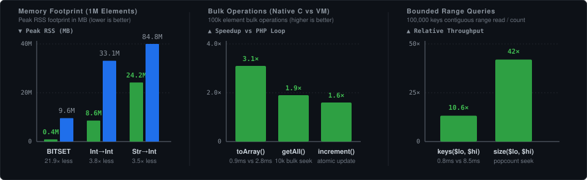
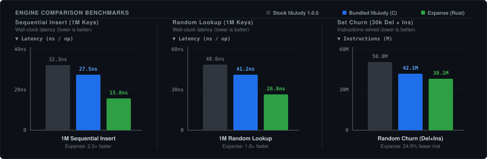

# PHP Judy

[](https://github.com/orieg/php-judy/actions/workflows/ci.yml)
[](https://packagist.org/packages/orieg/judy)
[](https://packagist.org/packages/orieg/judy/stats)
[](https://packagist.org/packages/orieg/judy)
[](LICENSE)
[](https://pecl.php.net/package/Judy)

**php-judy** provides high-performance, memory-efficient, ordered sparse dynamic arrays for PHP 8.1+ implementing 256-ary Judy digital tries.

A Judy array consumes memory only when populated and scales near $O(\log_{256} N)$ into the billion-element range. It shines in long-running PHP processes (CLI pipelines, queue workers, Swoole/RoadRunner/FrankenPHP/Octane) that hold large sparse keysets in memory.

---

## Visual Performance Comparison



---

## Why PHP Judy?

- **Dramatic Memory Savings**: Up to **21.9x less memory** than native PHP arrays for presence sets (`BITSET`), and **3.5–3.8x less memory** for sparse integer and string keys (measured as peak RSS).
- **Native C Bulk Operations**: `toArray()`, `getAll()`, `keys()`, `values()`, and `fromArray()` run in native C up to **3.1x faster** than element-by-element PHP loops.
- **Ordered Keys & Fast Slicing for Free**: Range queries, prefix invalidation (`keys($lo, $hi)`), and atomic updates (`increment()`) without hash-table sorting or full scans.
- **Dual-Engine Backing**: Bundles modernized **libJudy** (C, compiled by default) and fully supports **[Expanse](https://github.com/orieg/expanse)** (clean-room pure-Rust drop-in C ABI engine).
- **Honest Trade-offs**: For random lookups on small dense datasets, native PHP arrays are faster. See [BENCHMARK.md](BENCHMARK.md) for full metrics and a decision guide.

---

## What People Use It For

Each pattern below is a runnable script in [examples/](examples/README.md):

| Problem | Why Judy | Demo |
| ------- | -------- | ---- |
| "Have I seen this ID?" over millions of items — crawler frontiers, queue dedup, processed-ID sets | `BITSET` uses 18.5-22.7x less memory than a PHP array (21.9x at 1M elements) | [dedup-large-stream.php](examples/dedup-large-stream.php) |
| Which CIDR/tariff/shard does this value fall in? | `last()` resolves the greatest key ≤ N in one call; hash tables must scan | [ip-range-lookup.php](examples/ip-range-lookup.php) |
| Rate limiting and rolling metrics over a time window | `deleteRange()` expires aged-out buckets without touching the retained set | [sliding-window-rate-limit.php](examples/sliding-window-rate-limit.php) |
| Invalidate every cache key under `user:123:*` | Ordered keys make a namespace one contiguous slice — cost follows the slice, not the cache size | [prefix-invalidation.php](examples/prefix-invalidation.php) |
| List every class under `App\Domain\` — LSP completion, namespace-scoped analysis rules, PHPUnit `--filter` | A namespace prefix is one contiguous key range; `keys($lo, $hi)` reads exactly that slice in a single traversal | [symbol-table-prefix.php](examples/symbol-table-prefix.php) |
| Autocomplete / typeahead over a string keyset | `first()` + `searchNext()` walk a prefix in sorted order and stop once the dropdown is full | [autocomplete-trie.php](examples/autocomplete-trie.php) |
| Per-metric counters in a long-running worker | Atomic `increment()` skips the read-modify-write round trip | [worker-counters.php](examples/worker-counters.php) |

New to the extension? Start with [quickstart.php](examples/quickstart.php).

---

## Installation

The Judy C library is **bundled** under `libjudy/` and is compiled directly
into the extension by default, so none of the paths below need a system
libJudy installed. Passing `--with-judy=DIR` — the install prefix of a system
libJudy — dynamically links against that library instead and compiles nothing
under `libjudy/`; that mode remains supported and is CI-tested. The bundled
build requires a 64-bit target; on a 32-bit platform, use `--with-judy=DIR`.

### A. Using PHP PIE (Recommended)

PHP PIE (PHP Extension Installer) is the easiest way to install PHP Judy on supported platforms:

```sh
# Install PHP PIE if you don't have it (see https://php.github.io/pie/ for options)
curl -fsSL https://github.com/php/pie/releases/latest/download/pie.phar -o pie.phar

# Install PHP Judy using PIE
php pie.phar install orieg/judy
```

**Note**: PHP PIE automatically handles dependencies and builds the extension for your specific PHP version and platform. The package is listed on [Packagist](https://packagist.org/packages/orieg/judy) among the [PIE-installable extensions](https://packagist.org/extensions).

### A2. Docker

In Docker images based on the official `php` images, the simplest path is [`install-php-extensions`](https://github.com/mlocati/docker-php-extension-installer), which supports Judy on PHP 8.1+:

```dockerfile
FROM php:8.4-cli
ADD --chmod=0755 https://github.com/mlocati/docker-php-extension-installer/releases/latest/download/install-php-extensions /usr/local/bin/
RUN install-php-extensions judy
```

### A3. CI (GitHub Actions)

```yaml
- uses: shivammathur/setup-php@v2
  with:
    php-version: '8.4'
- name: Install PHP Judy
  run: |
    curl -fsSL https://github.com/php/pie/releases/latest/download/pie.phar \
      -o /usr/local/bin/pie && chmod +x /usr/local/bin/pie
    sudo pie install orieg/judy
```

No `libjudy-dev` step is needed: the bundled library is the default build.
This repository's own CI builds the same way — `phpize && ./configure && make`
with no `--with-judy` — which is also what proves the tree builds on a runner
with no system libJudy at all.

### B. Using PECL

You can also install PHP Judy using PECL:

```sh
# Install the extension with pecl
pecl install judy
```

**Note**: No system Judy library is required — the PECL package ships the
bundled libJudy and builds it by default. `pecl install` prompts for the
package's `with-judy` option, whose default is `bundled`; answer it with the
install prefix of a system libJudy only if you specifically want to link
against one.

### C. Linux (Manual Build)

From the PHP Judy sources:

```sh
phpize
./configure
make
make test
make install
```

This compiles the bundled libJudy into the extension; nothing else needs
installing. To link against a system libJudy instead, pass its install prefix:

```sh
apt-get install libjudydebian1 libjudy-dev   # Debian/Ubuntu
phpize
./configure --with-judy=/usr
make
make test
make install
```

If you build that system library yourself, read the flag warning in
[CONTRIBUTING.md](CONTRIBUTING.md#building-against-a-system-libjudy-instead)
first — it does not apply to the bundled build, whose compile flags are pinned
by `config.m4`.

### D. Windows

Prebuilt DLLs are attached to every
[GitHub release](https://github.com/orieg/php-judy/releases). Use those unless
you need to build yourself.

To build from source, there is no longer anything to download or patch first:
the bundled libJudy builds through `config.w32`, and the LLP64/Windows fixes it
needs are applied in-tree (patch P5 in
[libjudy/PATCHES.md](libjudy/PATCHES.md)). Extract the extension sources into
your php-sdk build tree where the build scripts pick them up, e.g.
`C:\php\pecl\judy\`, then from the Visual Studio command prompt:

```sh
buildconf
configure --with-judy=shared
nmake
```

CI builds and tests the **x64** configuration. To link a prebuilt or system
libJudy instead of the bundled sources, pass the directory holding
`libJudy.lib` (or `libJudy_a.lib`) and `Judy.h`:
`configure --with-judy=C:\path\to\judy`.

### E. Mac OS X

The recommended way to install `php-judy` on Mac OS X is `pie` or `pecl`. No
Homebrew Judy formula is needed — the bundled library is built in.

#### Using PHP PIE (Recommended)

```sh
# Install PHP PIE if you don't have it (see https://php.github.io/pie/ for options)
curl -fsSL https://github.com/php/pie/releases/latest/download/pie.phar -o pie.phar

# Install PHP Judy using PIE
php pie.phar install orieg/judy
```

#### Using PECL

```sh
pecl install judy
```

#### Manual Build

From the php-judy sources:

```sh
phpize
./configure
make
make test
```

To link Homebrew's libJudy instead of the bundled copy:

```sh
brew install judy
phpize
./configure --with-judy=/opt/homebrew
make
```

### F. Modern Engine: Expanse (Pure-Rust libjudy Replacement)

[Expanse](https://github.com/orieg/expanse) is a modernized, clean-room pure-Rust implementation of Judy arrays providing 100% drop-in C ABI compatibility with `libjudy` (`Judy1*`, `JudyL*`, `JudySL*`, `JudyHS*`), zero memory leaks, and native support for modern 64-bit microarchitectures (`x86-64-v1..v4`, `aarch64`, `riscv64`, and Windows MSVC).



#### Linux (.deb package)

Prebuilt packages are available on the [Expanse Releases page](https://github.com/orieg/expanse/releases):

```sh
# Download and install Expanse .deb (e.g. v0.2.0 for amd64)
curl -LO https://github.com/orieg/expanse/releases/download/v0.2.0/libexpanse_0.2.0_amd64.deb
sudo dpkg -i libexpanse_0.2.0_amd64.deb

# Compile php-judy against Expanse
phpize
./configure --with-judy=/usr
make -j$(nproc)
make test
sudo make install
```

#### Linux & macOS (Standalone Prefix or from Source)

```sh
# Option 1: Download prebuilt release tarball from https://github.com/orieg/expanse/releases
curl -LO https://github.com/orieg/expanse/releases/download/v0.2.0/expanse-0.2.0-x86_64-unknown-linux-gnu.tar.gz
tar -xzf expanse-0.2.0-x86_64-unknown-linux-gnu.tar.gz

# Option 2: Build expanse-capi from source with Cargo
git clone https://github.com/orieg/expanse.git
cd expanse && cargo build --release -p expanse-capi

# Assemble compat prefix (include/Judy.h + lib/libJudy.so or lib/libJudy.dylib)
mkdir -p /path/to/expanse-prefix/include /path/to/expanse-prefix/lib
cp crates/expanse-capi/include/Judy.h /path/to/expanse-prefix/include/
cp target/release/libexpanse.so /path/to/expanse-prefix/lib/libJudy.so  # On macOS: libexpanse.dylib -> libJudy.dylib

# Compile php-judy against the Expanse prefix
cd /path/to/php-judy
phpize
./configure --with-judy=/path/to/expanse-prefix
make -j$(nproc)
make test
```

#### Windows (MSVC) with expanse.dll

Unlike legacy C libjudy (which requires source code patches for 64-bit LLP64 `Word_t` and `PJERR`), Expanse natively supports 64-bit Windows without patching:

```powershell
# Extract expanse-v0.2.0-x86_64-pc-windows-msvc.zip (or build with cargo build --release -p expanse-capi)
# Setup prefix directory with include\Judy.h and lib\libJudy.lib
$prefix = "C:\path\to\expanse-prefix"
New-Item -ItemType Directory -Force -Path "$prefix\include", "$prefix\lib"
Copy-Item crates\expanse-capi\include\Judy.h "$prefix\include\"
Copy-Item target\release\expanse.dll.lib "$prefix\lib\libJudy.lib"
Copy-Item target\release\expanse.dll.lib "$prefix\lib\libJudy_a.lib"
Copy-Item target\release\expanse.dll "C:\Windows\System32\"

# Build php-judy
cd C:\path\to\php-judy
configure --with-judy=C:\path\to\expanse-prefix
nmake
```

## Usage Examples

Judy arrays can be used like usual PHP arrays. The difference will be in the type of key/values that you can use. Judy arrays are optimized for memory usage but it forces some limitations in the PHP API.

There are 10 types of PHP Judy Arrays, organized into three families:

### Integer-Keyed Types

#### 1. Judy::BITSET

A Judy array with only 1 bit per index. It can be used to store boolean values.

```php
$judy = new Judy(Judy::BITSET);
$judy[100] = true;
$judy[200] = true;
$judy[300] = false;

if ($judy[100]) {
    echo "Index 100 is set\n";
}
```

#### 2. Judy::INT_TO_INT

A Judy array with integer keys and integer values.

```php
$judy = new Judy(Judy::INT_TO_INT);
$judy[1] = 100;
$judy[2] = 200;
$judy[3] = 300;

echo $judy[2]; // Outputs: 200
```

#### 3. Judy::INT_TO_MIXED

A Judy array with integer keys and mixed values (strings, integers, etc.).

```php
$judy = new Judy(Judy::INT_TO_MIXED);
$judy[1] = "Hello";
$judy[2] = 42;
$judy[3] = [1, 2, 3];

echo $judy[1]; // Outputs: Hello
```

#### 4. Judy::INT_TO_PACKED

A Judy array with integer keys and serialized ("packed") values. Values are stored as opaque byte buffers outside PHP's garbage collector using `php_var_serialize`/`php_var_unserialize`. This trades serialize/deserialize CPU cost for reduced GC pressure, making it suitable for large datasets where GC pauses are a concern.

Supports any serializable PHP value (strings, integers, floats, arrays, objects). Closures and generators cannot be stored.

```php
$judy = new Judy(Judy::INT_TO_PACKED);
$judy[0] = "Hello";
$judy[1] = 42;
$judy[2] = [1, 2, 3];
$judy[3] = new DateTimeImmutable();

echo $judy[0]; // Outputs: Hello
// Values are fully reconstructed on read
$arr = $judy[2]; // Returns [1, 2, 3]
```

**When to use INT_TO_PACKED vs INT_TO_MIXED:**
- Use `INT_TO_MIXED` for small-to-medium arrays or when read/write speed is critical
- Use `INT_TO_PACKED` for large arrays (100K+ elements) where GC pause reduction matters more than individual read/write latency
- On memory: `INT_TO_MIXED` holds a pointer to a separately allocated zval per element and measures *larger* than a PHP array, while `INT_TO_PACKED` stores values as opaque buffers and measures smaller ([#172](https://github.com/orieg/php-judy/issues/172)). Pick `INT_TO_MIXED` for the ordering or the API, not the footprint

### String-Keyed Types (Trie-Based)

Trie-based types use JudySL internally. Keys are stored in sorted lexicographic order, making iteration ordered and range queries efficient. Lookup is O(key-length).

> **String keys are binary-safe for every byte except `0x00`.** High bytes (`0x80`, `0xFE`, `0xFF`) store, compare and sort as unsigned bytes on all six string-keyed types. A key containing an embedded NUL is rejected with an exception on all six, on every method that takes a string key — every type orders its keys through a JudySL trie, which indexes NUL-terminated C strings. Encode `pack()` output, raw digests and serialized payloads (base64, hex, or any NUL-free framing) before using them as keys. Values are unaffected.

#### 5. Judy::STRING_TO_INT

A Judy array with string keys and integer values.

```php
$judy = new Judy(Judy::STRING_TO_INT);
$judy["apple"] = 1;
$judy["banana"] = 2;
$judy["cherry"] = 3;

echo $judy["banana"]; // Outputs: 2
```

#### 6. Judy::STRING_TO_MIXED

A Judy array with string keys and mixed values.

```php
$judy = new Judy(Judy::STRING_TO_MIXED);
$judy["name"] = "John Doe";
$judy["age"] = 30;
$judy["scores"] = [85, 92, 78];

echo $judy["name"]; // Outputs: John Doe
```

### String-Keyed Types (Hash-Based)

Hash-based types use JudyHS for O(1) average-case lookups, with a parallel JudySL key index that maintains sorted iteration order. Best for workloads dominated by random key access where you still need ordered iteration.

By default an ordered walk over these types costs a second lookup per element to fetch the value. `optimizeIteration` removes it — see [Trading write speed for iteration speed](#trading-write-speed-for-iteration-speed).

#### 7. Judy::STRING_TO_INT_HASH

A hash-backed Judy array with string keys and integer values.

```php
$judy = new Judy(Judy::STRING_TO_INT_HASH);
$judy["session_abc"] = 1;
$judy["session_xyz"] = 2;

echo $judy["session_abc"]; // Outputs: 1

// Iteration is still sorted (via the key index)
foreach ($judy as $key => $value) {
    echo "$key => $value\n";
}
```

### Trading write speed for iteration speed

`STRING_TO_INT_HASH` and `STRING_TO_INT_ADAPTIVE` keep the key set in a sorted
index and the values in a separate store, so an ordered walk has to look each
value up a second time. Passing `optimizeIteration` keeps a copy of the value
alongside the key, which removes that second lookup — and makes every write
maintain both copies:

```php
// Read-dominated: a cache that is written once and iterated often.
$cache = new Judy(Judy::STRING_TO_INT_HASH, optimizeIteration: true);

// Write-dominated: leave it off. This is the default.
$counters = new Judy(Judy::STRING_TO_INT_HASH);
foreach ($events as $e) {
    $counters->increment($e);
}
```

Measured on an idle 24-core x86_64 host, 300K entries:

| | 16-byte keys | 40-byte keys |
| --- | --- | --- |
| `foreach` | 24.0% faster | 37.7% faster |
| `values()` | 28.5% faster | 46.7% faster |
| `filter()` | 29% faster | 39% faster |
| `offsetSet` overwrite | 19.5% slower | 7.6% slower |
| `increment()` | 19.5% slower | — |

Note that the write penalty is *worst* where the read win is *smallest*. If the
array is counter-heavy — and `increment()` exists precisely so counters do not
round-trip through PHP — leave it off.

Three properties worth knowing:

- **It is fixed for the life of the array.** There is no setter; turning it on
  later would mean rewriting the whole key index.
- **It is inherited.** `clone`, `slice()`, `filter()`, `map()`, the set
  operations and `__serialize`/`__unserialize` all carry it, so a derived array
  never quietly performs differently from the one it came from.
- **Other types accept and ignore it.** `BITSET`, the `INT_TO_*` family,
  `STRING_TO_INT`, `STRING_TO_MIXED` and the `_MIXED` hash types have nothing
  to mirror; `STRING_TO_INT_ADAPTIVE` honours it only for keys of 8 bytes or
  more, because shorter ones are already stored somewhere cheap to read. That
  means generic code can pass the argument unconditionally. Ask
  `isIterationOptimized()` what actually took effect:

```php
$j = new Judy($typeFromConfig, optimizeIteration: true);
var_dump($j->isIterationOptimized()); // false unless the type can honour it
```

#### 8. Judy::STRING_TO_MIXED_HASH

A hash-backed Judy array with string keys and mixed values.

```php
$judy = new Judy(Judy::STRING_TO_MIXED_HASH);
$judy["config_a"] = ["enabled" => true];
$judy["config_b"] = 42;
```

### String-Keyed Types (Adaptive / SSO)

Adaptive types use Short-String Optimization (SSO): keys of 7 bytes or fewer are packed into a 64-bit integer and stored in a JudyL array, avoiding hashing overhead entirely. Longer keys fall back to JudyHS. A JudySL key index maintains sorted iteration. Best for mixed-length key workloads with many short keys.

#### 9. Judy::STRING_TO_INT_ADAPTIVE

An adaptive Judy array with string keys and integer values.

```php
$judy = new Judy(Judy::STRING_TO_INT_ADAPTIVE);
$judy["us"] = 1;       // SSO: packed into JudyL (2 bytes)
$judy["uk"] = 2;       // SSO: packed into JudyL (2 bytes)
$judy["a_very_long_country_name"] = 3;  // Falls back to JudyHS
echo $judy["us"]; // Outputs: 1
```

#### 10. Judy::STRING_TO_MIXED_ADAPTIVE

An adaptive Judy array with string keys and mixed values.

```php
$judy = new Judy(Judy::STRING_TO_MIXED_ADAPTIVE);
$judy["id"] = 12345;
$judy["name"] = "Alice";
$judy["metadata"] = ["role" => "admin"];
```

### Iterator Interface (PHP 8+)

Judy arrays implement the PHP Iterator interface, allowing you to use them in foreach loops:

```php
$judy = new Judy(Judy::INT_TO_MIXED);
$judy[1] = "First";
$judy[5] = "Fifth";
$judy[10] = "Tenth";

// Iterate through all elements
foreach ($judy as $key => $value) {
    echo "Key: $key, Value: $value\n";
}

// Manual iteration
$judy->rewind();
while ($judy->valid()) {
    $key = $judy->key();
    $value = $judy->current();
    echo "Key: $key, Value: $value\n";
    $judy->next();
}
```

### Performance Considerations

- **Memory Efficiency**: 2-5x less memory than PHP arrays for integer and string keys and 18.5-22.7x for `BITSET`, measured as peak RSS — but `INT_TO_MIXED` uses ~1.3x *more* than a PHP array, so it is not a memory optimization. Per-type figures: [BENCHMARK.md](BENCHMARK.md#memory--the-headline-and-the-least-equivocal-result)
- **Sequential Access**: Excellent performance for ordered iteration
- **Range Queries**: Native support via `slice()`, `deleteRange()`, and the bounded forms of `keys()`, `values()`, `toArray()` and `size()`
- **Random Access**: Trie types are slower than PHP arrays (O(log n) vs O(1)); Hash types offer O(1) average-case lookups for string keys
- **String Lookups**: Use `STRING_TO_*_HASH` or `STRING_TO_*_ADAPTIVE` types for faster string key access when sorted traversal is not the primary use case

### Batch Operations and Conversion

Judy arrays provide batch methods for efficient bulk operations:

```php
// Convert a PHP array to a Judy array
$judy = Judy::fromArray(Judy::INT_TO_INT, [0 => 100, 5 => 200, 10 => 300]);

// Convert a Judy array back to a PHP array
$arr = $judy->toArray(); // [0 => 100, 5 => 200, 10 => 300]

// Bulk-insert from an existing array
$judy->putAll([20 => 400, 30 => 500]);

// Retrieve multiple values at once (missing keys return null)
$values = $judy->getAll([0, 5, 99]); // [0 => 100, 5 => 200, 99 => null]

// Read only part of the key space: keys(), values(), toArray() and size() all
// take an inclusive range, with null leaving that side unbounded
$judy->keys(5, 20);      // [5, 10, 20]
$judy->toArray(5, 10);   // [5 => 200, 10 => 300]
$judy->values(null, 5);  // [100, 200]

// To count a range rather than read it, size() runs the same traversal and
// materialises nothing — prefer it to count($judy->keys($lo, $hi))
$judy->size(5, 20);      // 3
```

A bounded read is one traversal writing straight into the returned PHP array,
so prefer it to `slice($lo, $hi)->keys()`, which first copies the range into a
new Judy array and then traverses that copy.

> **Ranges are keys, not offsets.** Every range argument in this API —
> `slice()`, `deleteRange()`, `populationCount()`, `size()`, and the bounded
> forms above — is a pair of **inclusive keys**. Read `keys(5, 10)` as
> `range(5, 10)`, not as `array_slice($a, 5, 10)`: it returns the keys *between*
> 5 and 10, and nothing at all if none are set. If you want the element at a
> *position*, that is `byCount($n)`. Bounding by key is a seek plus a walk, so a
> narrow range out of a huge array costs the range rather than the array — which
> is the reason the distinction is worth keeping.

### Atomic Increment

For `INT_TO_INT`, `STRING_TO_INT`, and `STRING_TO_INT_HASH` types, `increment()` performs an efficient counter update:

```php
$counters = new Judy(Judy::STRING_TO_INT);

// Increment creates the key with the given amount if it doesn't exist
$counters->increment("page_views");       // returns 1
$counters->increment("page_views");       // returns 2
$counters->increment("page_views", 10);   // returns 12
$counters->increment("page_views", -3);   // returns 9
```

`increment()` is the reason `optimizeIteration` defaults to off: on
`STRING_TO_INT_HASH` it measures 19.5% slower with the option on, because the
counter has to be written in two places. A counter table should be constructed
plainly.

For detailed performance analysis, see [BENCHMARK.md](BENCHMARK.md).

### Expanded API

Beyond basic array access, Judy provides a rich API including:

- **Set operations**: `union()`, `intersect()`, `diff()`, `xor()`, `mergeWith()`
- **Functional iteration**: `forEach()`, `filter()`, `map()` (C-level, bypasses Iterator overhead)
- **Range operations**: `slice()`, `deleteRange()`, and the bounded forms of
  `keys()`, `values()`, `toArray()` and `size()` — with `populationCount()` as
  the integer-only O(1) counter
- **Aggregation**: `sumValues()`, `averageValues()`
- **Batch operations**: `putAll()`, `getAll()`, `keys()`, `values()`, `toArray()`, `fromArray()`
- **Serialization**: `serialize()`/`unserialize()`, `json_encode()`
- **Comparison**: `equals()`

For complete method signatures, parameter details, and type compatibility, see [API.md](API.md).

## Debugging and Profiling

### Judy and Xdebug coexist

Judy is an ordinary **module** extension: it registers a class and a set of
object handlers and does not hook the executor. Xdebug is a **zend_extension**
that does hook the executor. The two do not overlap, and load order is
irrelevant.

That was verified rather than assumed: in a container with both loaded
(`php:8.4-cli`, judy built from source, Xdebug 3.5.3 from PECL), both report
loaded, `var_dump()` of a Judy object renders correctly under
`xdebug.mode=develop` (Xdebug replaces `var_dump()`, and it goes through the
same handler), iteration works, and swapping the order of `-d extension=judy.so`
and `-d zend_extension=xdebug.so` changes nothing.

### The blind spot: Judy memory is invisible to memory profiling

Judy allocates through the C allocator, outside PHP's memory manager. So
`memory_get_usage()` does not see it — and neither does anything built on top
of it, including Xdebug's per-function memory column. Filling a
`STRING_TO_INT` with 50,000 keys inside a function, traced with
`xdebug.mode=trace`:

| Function                       | Xdebug memory delta | Actually allocated             |
| ------------------------------ | ------------------- | ------------------------------ |
| `fill_judy(50000)`             | 65,696 bytes        | ~1.24 MB (`memoryUsage()`)     |
| `fill_php_array(50000)`        | 4,941,520 bytes     | 4,941,520 bytes                |

The 65 KB charged to `fill_judy()` is PHP-side overhead (the object, the key
zvals); not one byte of the ~1.24 MB of trie the call actually allocated
appears anywhere in the trace, while the PHP array is reported in full. A
memory-limit investigation driven by those numbers concludes the Judy array is
nearly free — the opposite of what is happening.

Two things do see it:

- **`Judy::memoryUsage()`** — the only in-process view. Exact for
  integer-keyed types, approximate (payload bytes, a lower bound) for
  string-keyed ones; see [BENCHMARK.md](BENCHMARK.md#understanding-judymemoryusage).
- **Peak RSS**, `getrusage()['ru_maxrss']`, measured in a **separate process**
  per configuration — the honest way to compare Judy against a PHP array,
  since only one of the two is visible to PHP's own accounting.

```php
// Run each variant in its own process; comparing them in one process is
// meaningless because neither allocation is released to the OS on time.
$judy = new Judy(Judy::STRING_TO_INT);
for ($i = 0; $i < 1_000_000; $i++) { $judy["key_$i"] = $i; }
printf("memoryUsage: %d bytes (approximate)\n", $judy->memoryUsage());
printf("peak RSS:    %d\n", getrusage()['ru_maxrss']);
```

### What profilers do tell you: dispatch cost

The signal Xdebug gives accurately is **call counts**, and that is what usually
points at the real fix. With bracket syntax (`$judy[$key]`) the engine calls the
extension's dimension handler directly, so nothing named `Judy` appears in the
trace at all and the cost lands in the enclosing function. Explicit
`$judy->offsetGet($key)` calls do appear, one line per lookup — 5,000 lookups
show up as 5,000 `Judy->offsetGet` entries in both the trace and the cachegrind
profile, while the bulk equivalent is a single `Judy->getAll` entry.

Either way, a hot loop doing one lookup per element is the thing to replace:

```php
// Per-element dispatch
foreach ($keys as $k) { $sum += $judy[$k]; }
$copy = []; foreach ($judy as $k => $v) { $copy[$k] = $v; }

// One C-level call instead
$sum  = array_sum($judy->getAll($keys));
$copy = $judy->toArray();
```

Measured (BENCHMARK.md Tables 5 and 6): `getAll()` is **1.9x** faster than
individual lookups for integer keys on 10K lookups over 100K elements, and
`toArray()` is **2.8x** faster than a manual `foreach` for 100K integer-keyed
elements (**3.1x** for string keys). `forEach()`, `filter()` and `map()` are the
same trade for callback-driven loops.

### What a debugger shows

`var_dump()`, `print_r()` and IDE variable panes (PhpStorm/VS Code over DBGp)
all read the same `get_debug_info` handler, which renders a Judy object as
(condensed — `var_dump()` prints each value on its own line):

```
object(Judy)#1 (7) {
  ["type"]=>                      string(20) "STRING_TO_MIXED_HASH"
  ["count"]=>                     int(2)
  ["memoryUsage"]=>               int(68)
  ["memoryUsageIsApproximate"]=>  bool(true)
  ["firstKey"]=>                  string(5) "alpha"
  ["lastKey"]=>                   string(4) "beta"
  ["preview"]=>                   array(2) { ... }
}
```

- `count`, `firstKey` and `lastKey` always describe the **whole** array.
- `preview` is a **sample**, capped at `judy.debug_preview_size` (default 16,
  `PHP_INI_ALL`, so `ini_set()` works mid-session). `0` disables the element
  preview and leaves metadata only; negative values clamp to 0. The cap exists
  because a dump has to stay cheap enough to be safe at a breakpoint —
  serializing millions of elements over DBGp would hang the session.
- Whenever fewer elements are shown than the array holds — including the `0`
  case — a `previewTruncated` entry states the true total, e.g.
  `showing 16 of 1000000 elements (judy.debug_preview_size=16)`. **Never read
  element counts off a preview**; use `count()`, `toArray()`, `keys()` or
  `values()`, which the INI does not affect.
- `memoryUsageIsApproximate` appears only for string-keyed types, marking the
  `memoryUsage` figure on the line above as a payload-only lower bound.

## Ecosystem

- **[orieg/judy-polyfill](https://github.com/orieg/judy-polyfill)** — pure-PHP
  fallback providing the `Judy` class API when the extension is absent.
  Library authors: depend on the polyfill (`composer require
  orieg/judy-polyfill`) and suggest `ext-judy`; users who install the
  extension get native performance transparently. Parity with the extension
  is CI-verified on every PHP version.
- **[orieg/judy-cache](https://github.com/orieg/judy-cache)** — PSR-16 cache
  (plus a Symfony Cache adapter) backed by Judy's sorted trie, with O(range)
  prefix invalidation for long-running PHP (Octane, Swoole, RoadRunner,
  FrankenPHP workers).

## Reporting Bugs

Please report bugs and issues on the GitHub repository:

[https://github.com/orieg/php-judy/issues](https://github.com/orieg/php-judy/issues)

## Roadmap

- Eliminate redundant JLG+JLI double traversal in write hot paths for `INT_TO_INT`, `STRING_TO_INT`, and `STRING_TO_INT_HASH` types
- Remove the per-element second lookup during ordered traversal of the
  `STRING_TO_MIXED_HASH` and `STRING_TO_MIXED_ADAPTIVE` types
  ([#85](https://github.com/orieg/php-judy/issues/85)). Done for the two `_INT`
  variants, behind the opt-in `optimizeIteration` constructor argument — see
  [Trading write speed for iteration speed](#trading-write-speed-for-iteration-speed).
  The `_MIXED` payload is a `zval*`, so mirroring it is a question about
  lifetime rather than about lookups.
- Binary serialization format for faster `__serialize`/`__unserialize`
- Extend `increment()` to adaptive types

Retired: *"C-level `forEach()`/`filter()`/`map()` performance tuning (vtable
dispatch)"*. Measurement in [#85](https://github.com/orieg/php-judy/issues/85)
found userland callback dispatch is only ~10 ns/element inside a 6-15 ns glue
bucket, and `Judy::forEach()` on `INT_TO_INT` (26.4 ns/element) already beats
`array_map()` over a native PHP array (29.0). The addressable cost was
elsewhere: the `filter()` half shipped in
[#86](https://github.com/orieg/php-judy/pull/86), and the larger second-lookup
item is listed above.

Whether the extension should keep libJudy as its backend at all — measured
against the Adaptive Radix Tree, with Masstree/HOT/Wormhole considered — is
evaluated in [BACKEND_EVALUATION.md](BACKEND_EVALUATION.md). Current verdict:
keep Judy.

## Releasing

A release touches two version files, which must stay in lockstep (CI enforces both):

1. `php_judy.h` — `#define PHP_JUDY_VERSION "X.Y.Z"`
2. `package.xml` — `<release>`/`<api>` and `<date>`; move the previous release's `<notes>` into `<changelog>`, then add the new `<notes>`

Then:

3. Refresh `BENCHMARK.md` version/date stamps.
4. Confirm the CI performance baseline in `.github/workflows/ci.yml` (the `pie install orieg/judy:X.Y.Z` step) names the *previous* release, so benchmark comparisons stay apples-to-apples. Normally it already does — step 7 of the previous release set it.
5. Tag and publish the GitHub release as `vX.Y.Z`. The `Publish Release` workflow validates the tag against `package.xml`, builds the Windows DLLs, and attaches them plus the PECL `.tgz`.
6. Upload the `.tgz` to pecl.php.net (manual, requires a PECL account).
7. **Once the release is actually on pecl.php.net**, in one dedicated commit (never inside a feature PR — it is a baseline move):
   - bump the `pie install orieg/judy:X.Y.Z` pin in `.github/workflows/ci.yml` to the just-published release, and
   - replace `baselines/latest.json` with the `benchmark-linux-php8.4` artifact from the CI run **on the tagged commit**, keeping the parameters identical to the baseline it replaces (PHP 8.4, Linux x86_64, size 500000, iterations 7, suite `all`).

   Neither can be done before the tag exists and the package is installable: the numbers must come from a build that reports the new version, and the pin must resolve on PECL. Record the interleaved comparison and its PHP-array control in the commit message, as `0b064b0` does.

`baselines/arm-ratios.json` is **not** part of this cycle. It is the cross-platform gate's reference, refreshed by `bench-gate.php --derive --update-baseline` when a platform's floors need re-deriving — also in its own PR, but on the gate's schedule rather than the release's. See [BENCHMARK.md](BENCHMARK.md#reproducing-the-gate-on-any-platform).

`Dockerfile.validate` can smoke-test an already-built `.tgz` via `pecl install`.

## License

This project is licensed under the PHP License - see the [LICENSE](LICENSE) file for details.

The source tree also bundles libJudy under `libjudy/`, licensed
LGPL-2.1-or-later, Copyright (c) 2002 Hewlett-Packard Company — see
[THIRD-PARTY.md](THIRD-PARTY.md) and [libjudy/COPYING](libjudy/COPYING).
Users are free to modify the files under `libjudy/` and recompile the
extension under the terms of LGPL-2.1; all applied patches are documented
in [libjudy/PATCHES.md](libjudy/PATCHES.md).

## Contributing

Contributions are welcome! Please feel free to submit a Pull Request.

## Support

- **API Reference**: [API.md](API.md) for complete method documentation
- **Benchmarks**: [BENCHMARK.md](BENCHMARK.md) for performance analysis
- **Migration Guide**: [MIGRATION_2.5.0.md](MIGRATION_2.5.0.md) for the 2.5.x line (incl. 2.5.1),
  [MIGRATION_2.2.0.md](MIGRATION_2.2.0.md) for version 2.2.0 changes
- **Examples**: Check the [examples/](examples/README.md) directory for runnable demos (dedup, range lookup, rate limiting, prefix invalidation, autocomplete, counters) — indexed by problem under [What people use it for](#what-people-use-it-for)
